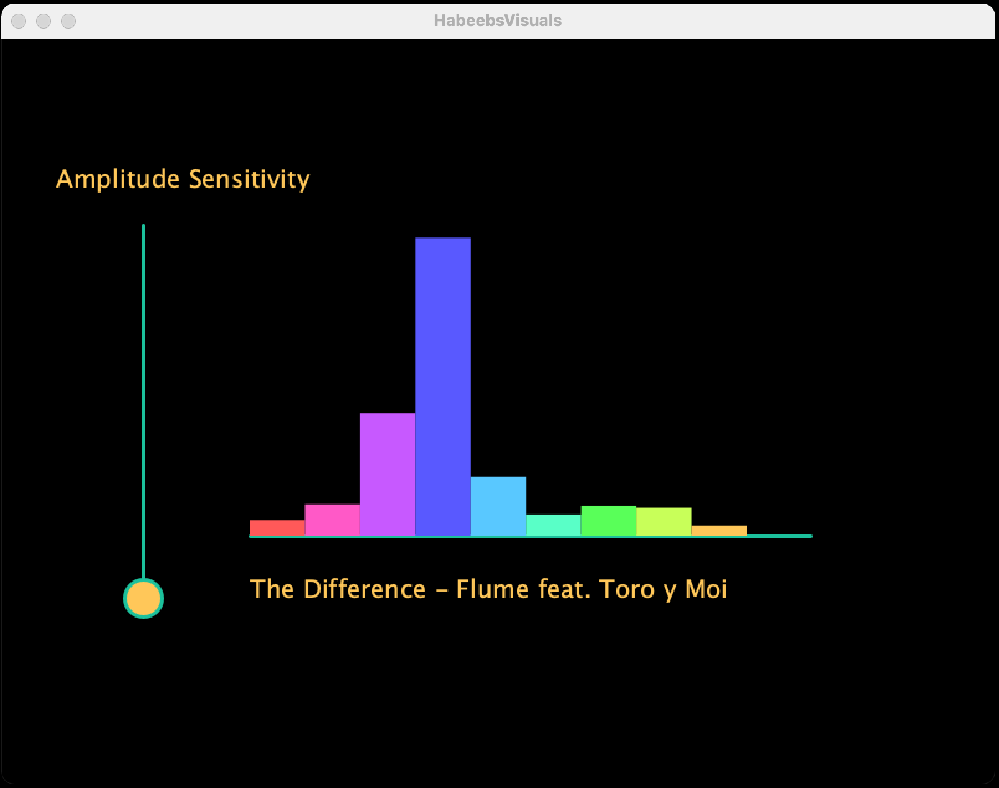
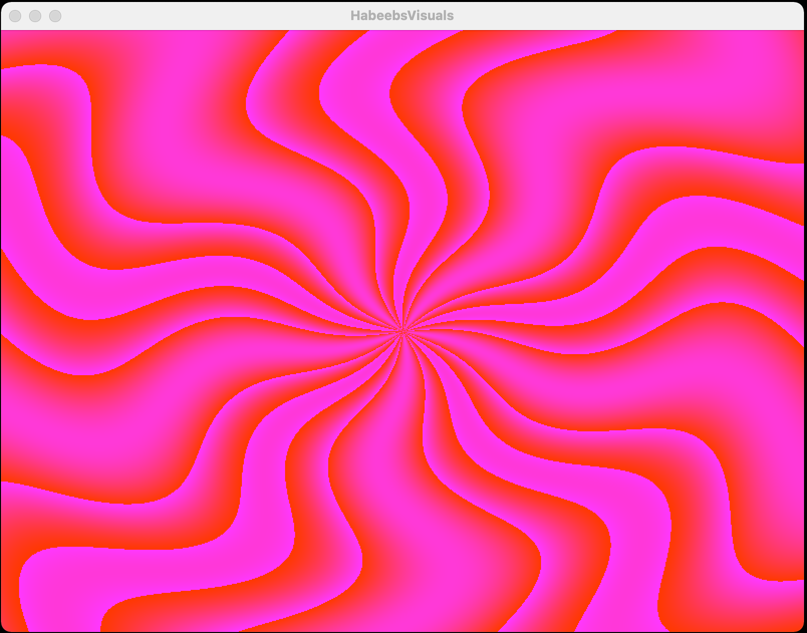
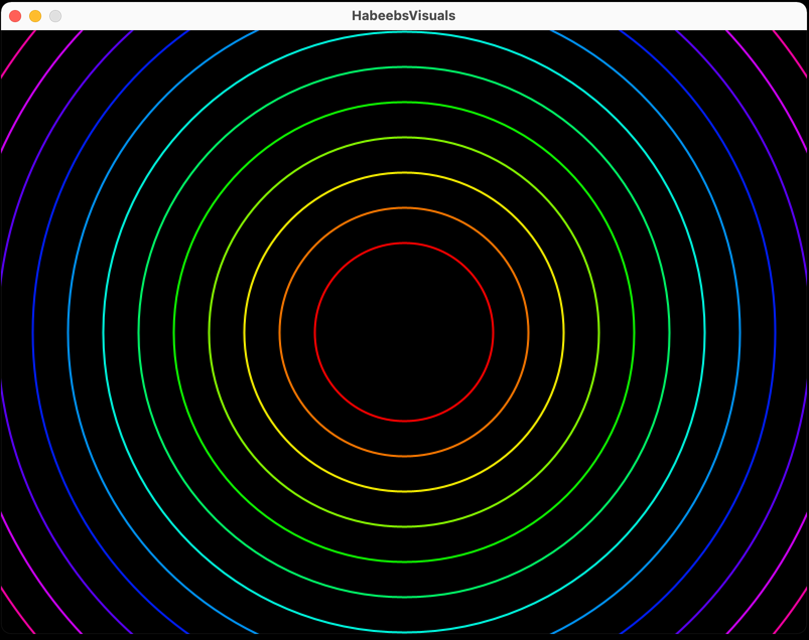
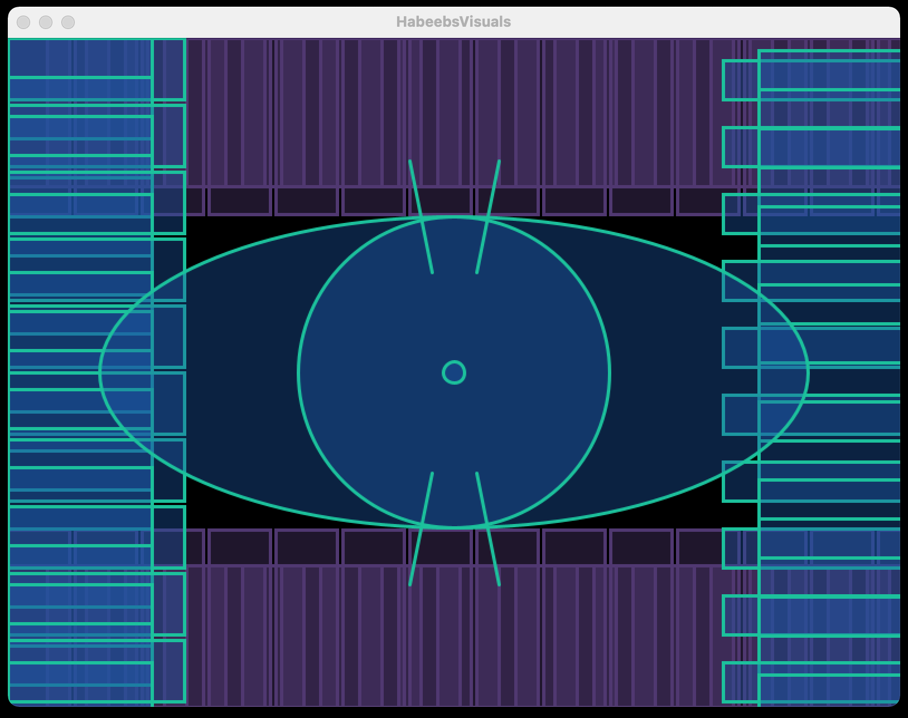
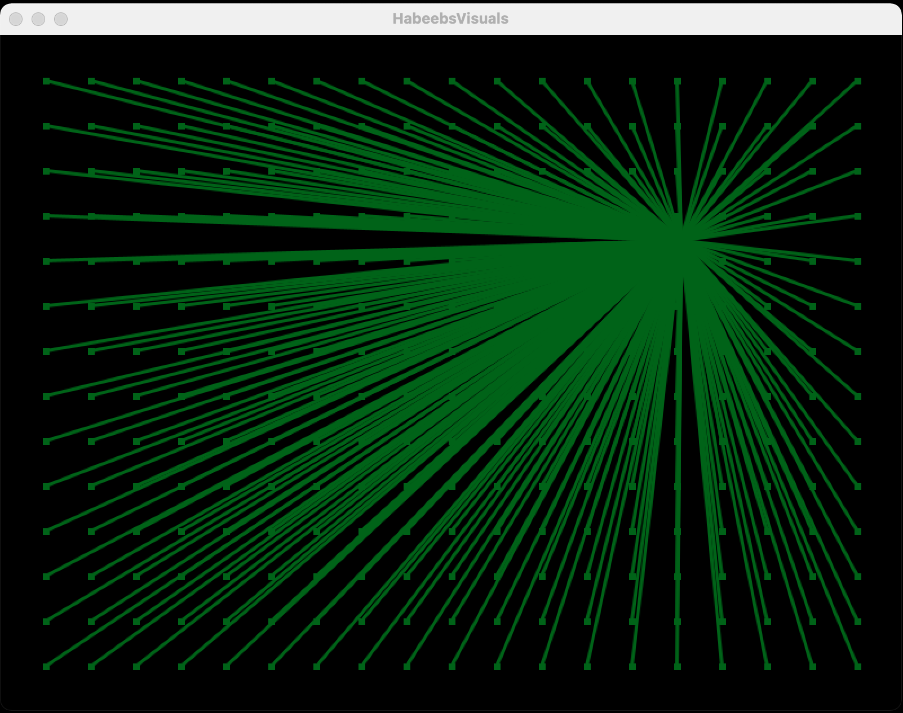

# Music Visualiser Project

Name: Habeeb Alao

Student Number: C20362766

## Instructions
- Fork this repository and use it a starter project for your assignment
- Create a new package named your student number and put all your code in this package.
- You should start by creating a subclass of ie.tudublin.Visual
- There is an example visualiser called MyVisual in the example package
- Check out the WaveForm and AudioBandsVisual for examples of how to call the Processing functions from other classes that are not subclasses of PApplet


# Description of the assignment
This assignment is a java project which aims to visualise audio input from a users microphone. This project reacts dynamically to audio input producing changing shapes and colours . My song of choice is The Difference by Flume ft Toro y Moi. There are a total of 6 java classes which contain unique music visuals. 

This project uses methods from the proscessing library. Using lines, Rectangles and ellipses to create visuals. using the audio buffer.

# Instructions
Upon running launching the java project you will be met by a disignated visual from there you will be able to select a visual within the range of 6 that are available.

| Input |  Visual Rendered |
|-----------|-----------|
|1 | EyesVisual |
|2 | AmplitudeVisual |
|3| CircleVisual |
|4 | ColourCircleVisual |
|5 | WaveyVisual |
|6| GridFlashVisual |


# How it works

when the project is run you will be able to traverse the visuals by using the numbers on your keyboard. From main HabeebVisuals will be called and this is where the menu system is implemented from here you will be able to travel to each visual as stated above. 


# What I am most proud of in the assignment 
i am most proud of my custom amplitude sensitivity along with the wavey visual. I had to use a wide rnage of newly learned things. making the audi bands fit and the area and also making them dynamic was a challenge that paid off. also understanding how the pixels operated from the processing library was difficult but im proud that I was able to grasp these new concepts.



```Java
public  void  barsAndSliders() {
	mv.stroke(118, 218, 193);
	// vertical line
	mv.line(this.mv.width  /  7, this.mv.height  - (this.mv.height  /  4), this.mv.width  /  7, (this.mv.height  /  4));
	
	// horizontal line
	mv.line((this.mv.width  /  4), this.mv.height  - (this.mv.height  /  3), this.mv.width  - (this.mv.width  /  6) -  16,
	this.mv.height  - (this.mv.height  /  3));
	mv.circle(this.mv.width  /  7, prevMouseVal, 30);

	mv.textSize(20);
	mv.textMode(LEFT);
	mv.text("The Difference - Flume feat. Toro y Moi", (this.mv.width  /  4), this.mv.height  - (this.mv.height  /  4));

	mv.textMode(CENTER);
	mv.text("Amplitude Sensitivity", this.mv.width  /  18, (this.mv.height  /  5));
	if ((mv.mousePressed  ==  true) & (mv.mouseY  > (this.mv.height  /  4))
	& (mv.mouseY  <  this.mv.height  - (this.mv.height  /  4))) {
		prevMouseVal =  this.mv.mouseY;
	}
	mv.colorMode(PApplet.HSB);

	float gap = (this.mv.height  - (this.mv.height  /  3) - (this.mv.width  /  4)) / ((float) mv.getBands().length) *  2;

	mv.noStroke();

	for (int i =  0; i <  mv.getBands().length; i++) {

		mv.fill(PApplet.map(i, 0, mv.getBands().length, 255, 0), 255  - prevMouseVal /  5, 255);

		mv.rect((this.mv.width  /  4) + i * gap, this.mv.height  - (this.mv.height  /  3), gap,
			-mv.getSmoothedBands()[i] * (10000.0f  / prevMouseVal));
	}

}
```




```java
public  void  TheFlash() {
	mv.background(0);
	mv.loadPixels();
	float n = (float) ((mv.getAmplitude() *  10000.0) /  mv.width);
	float w = (float) 16.0;
	float h = (float) 16.0;
	float dx = w /  mv.width;
	float dy = h /  mv.height;
	float x =  -w /  2;

	for (int i =  0; i <  mv.width; i++) {
		float y =  -h /  2;
		for (int j =  0; j <  mv.height; j++) {
			float r =  mv.sqrt((x * x) + (y * y));
			float theta =  mv.atan2(y, x);
			float val =  mv.sin(n *  mv.cos(r) +  5  * theta);
			mv.pixels[i + j *  mv.width] =  mv.color((int) ((val +  mv.getAmplitude()-200) *  255.0));
				y += dy;
			}
	x += dx;
	}
	mv.updatePixels();
}

```


# Project Demonstration

This is an image using a relative URL:






This is a YouTube video demoing this java project:
[](https://youtu.be/nnImjiJUskk)


## Referencenes

[Proscessing Documentation](https://processing.org) 
