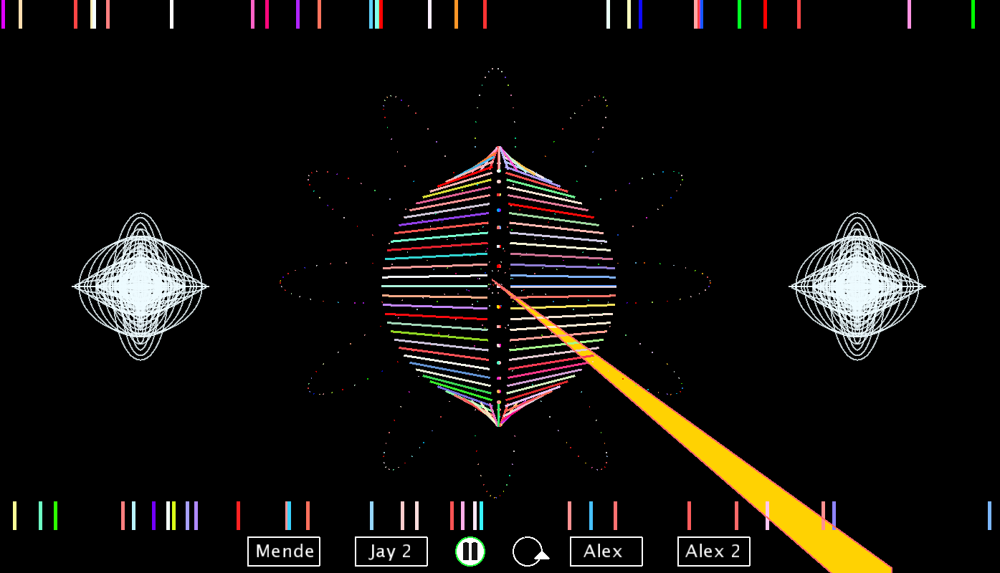
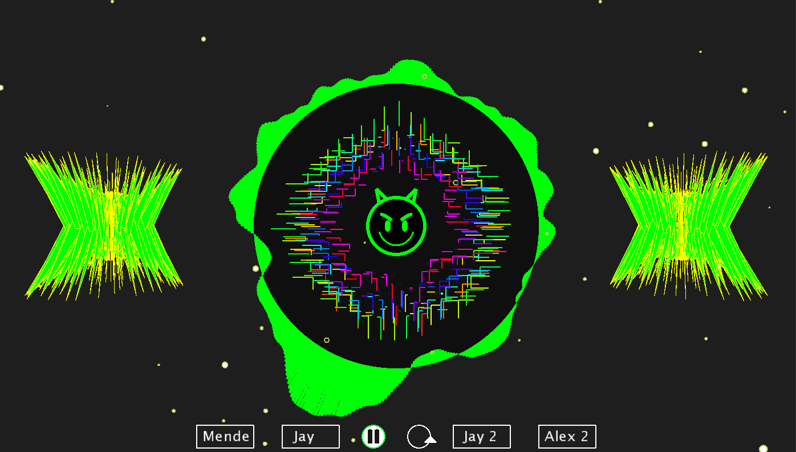
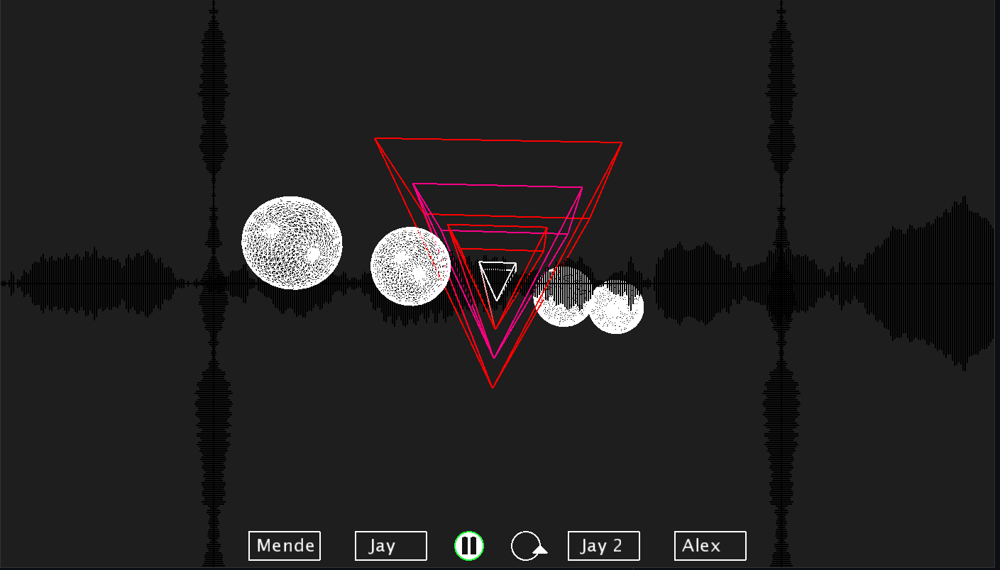
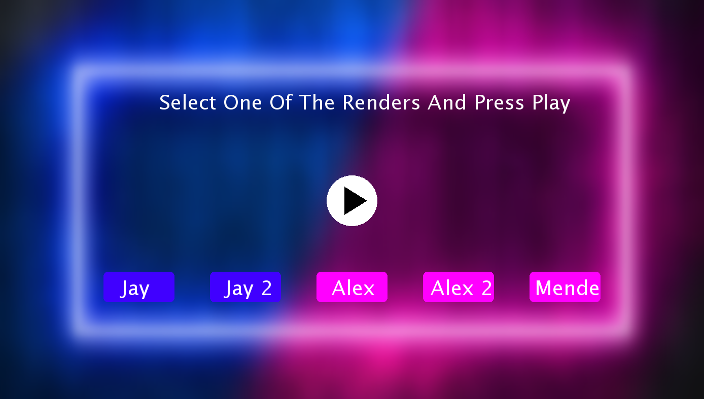

# Music Visualiser Project

Name: Alexander Dergach, Jaycel Estrellado, Mendbayar Bat-Orshikh

Student Number: C20401562, C20372876, C20458384

Song: Love Is A Miracle, *Jinco*

# Description of the assignment
Welcome to our Music Visualizer Project. This assignment will consist of 5 distinct visual effects. An interactive menu will be displayed and as the user, you are able to switch through different renders using button clicks.

### First Visual

The first Visual is comprised of 3 components, center, side and top/bottom. 
In the center there is two distorted semi circles, made of thin lines each respective line being sound responsive with both size and colour, they are separated giving room for a row of ellipses in the middle, which are also synchronizing with the music. From the very center steams a flower pattern made of dots along with a beam of colour going off to the corner of the screen, the flower petal design vibrating as the music plays intensifies with the amplitude, the lazer beam also being sound responsive and only visible when the actual song is playing.
At the sides you will find two identically placed illustrations, made of ellipses with no fill creating a scribble effect and the width and height of the ellipses changing with the song. 
Random generated lines are placed at the top and bottom of the screen and it is also synchronizing with the music- adding a more visualizing effect to the program.
Adding this randomly generated beams, creates a more chaotic approach to the visual contrasting with the other effects.



### Second Visual

The second Visual has a more symmetrical element, using 3 cubes on the center line, with a sphere in the very center, and sin waves covering the border of the screen.
The very center Cube is actually comprised of multiple smaller cubes creating one large cuboid, this cube is a plain grey colour at first but it changes colour values only when the beat is detected. In the center of the cuboid is a white sphere with a fixed position giving the user a fixed point on the visual. This is needed as each cube is rotating and it gives a sense of order to the elements. This rotation is depended on the amplitude of the song playing, when paused the cubes remain in there fixed position only rotating by the default amount.
The two side cubes are music responsive and will rotate as well as change colour with the music as the cuboid, since they are not filled in, with the rotation and colour change they give a slight pop out visual - adding to the already 3D effect.
The Sin waves on the borders are sound responsive and move according to the calculated frequency, there colours being of the full rainbow spectrum giving the visual a nice colour. This vibrant colour scheme will be seen through the rest of the visuals.


### Third Visual

Our Third Visual contains the most aspects. In the center we have a custom made *Devil* emoji, lines radiating from the center in a black circle that has a smooth sin wave curving in and our of the circles borders. On the sides we have two almost 3D looking rotating triangles creating an X graphic, a beat responsive practical background. All the colours being of the rainbow spectrum responsive to the amplitude of the song to keep this visual uniform.
The devil emoji creates a center piece for the visual, with the strokes being colour responsive to the music, around it are vertical and horizontal lines that are also colour responsive along with moving with the sound, as it intensifies the lines start creating different shapes around the devil emoji creating a very interesting effect, from donuts to squares. The circle that holds both those elements has a sin wave as its border, smoothened to create a wave effect that is amplified with the song.
The two side graphics are made to look 3D a lot they are just triangles rotating from the center, once fully rotated creating an X and its scale, once fully rotated, is depended on the amplitude of the song.
The background is made of a natural flowing partials that speed up the flow as the songs frequency increases along with partials that only appear upon  beat detection.



### Fourth Visual

The fourth visual, is the more geometrical of the visuals, giving a new sense to the project, comprised of a 3D center piece along with multiple evenly placed sin waves.
In the center are four nested triangles made up of vectors, each triangle being colour responsive to the sound and getting bigger as the layers go. The center triangle is a fixed white colour to match the 4 spheres that are around the triangle, giving the visual a fixed look. The spheres along with the triangles are being rotated by a fixed rate, amplified by the songs amplitude, similar to the cuboid logic. The spheres along with being rotated also scale in size with the sound. The colours for this visuals are a little darker to change the up the feel of the very vibrant visuals, with the sin waves being black rather then rainbow, being evenly places horizontally and vertically.



### Fifth Visual

The fifth visual makes a pulsating "eye" effect.

It features a big red outermost layer of the eye that is made up of an array of ellipses giving it the further detail that an eye has while also changing size depending on the amplitude of the song. The outermost layer also changes to random colours when a beat is detected giving it a creepy vibe. The middle layer is there to fill in the space between the iris and outer layer so the composition of the graphic doesn't look empty. The iris is made to bump up and down like the outer layer but instead of soreading to the inside and outside, this layer just spreads outside. This effect also lets us have an after image when the song is finished where the irish slowly transitions and fades away.   

# Instructions

### Starting Visuals

- First you clone this repository
- Open it in an IDE, press *F5* to run the visual
- Opening the Main Menu

### Main Menu

- You may select a render and press on the middle play button to play that persons render



- Menu will collapse into a lower menu, you are able to *loop*, *pause/play*, or *change* to another persons render


# How it works

Being the assignment we created a Main class to operate our renders, extending the visuals class from ie/tudublin and inheriting from the Mimim library. 
- 3D = True
- Size of window = 1400 x 800
- Colour Mode = HSB

Also to give a big thank you to past years creative inspirations!

From here we were able to call all the other classes within a switch statement starting with the menu class by default.
```java
	if(allowToPlay){
		switch (mode) 
		{

		case 0:
			break;
		case 1:
			jay.render();
			startm.lowerMenu();
			break;
		case 2:
			jay2.render();
			startm.lowerMenu();
			break;
		case 3:
			for(int i = 0; i < particals; i++)
			{
				partical[i].render(); 
			}
			alex.render();
			startm.lowerMenu();
			break;
		case 4:
			alex2.render();
			startm.lowerMenu();
			break;
		case 5:
			mende.render();
			startm.lowerMenu();
			break;

		}
	}else{
		startm.render();
	}
```
<<<<<<< HEAD

The menu works off the *public void mouseClicked()* method, creating statements to allow the program to verify which render the user selected on the menu, and if it was selected then the user is allowed to play, the mode for the switch statement set for which render the user picked.
Once the user selects a render the menu is collapsed down, with an array of renders showing at the button along with a responsive play/pause button which changes depending on the songs state.

The sub classes, inherit from *Start.java* along with *Visuals.java*. With the use of processing we were able to create sound responsive designs by mapping the values from index's of a for loop and the audio buffers of the song as such:

```java
	float index = PApplet.map(i, 0 , 180 , 0, ab.size() - 1);
	s.stroke(PApplet.map(index, 0, ab.size(), 0, 255), 255,255);
```

The same logic being used to make it rotate to sound and grow in scale.
For a lot of the geometrical aspects of the visuals we needed to use mathematical formals such as sin, cos and radius' and example being the third graphics center circles smoothened border waves.

```java
	for(float i = 0f; i < 360; i += space){

		float xoff = PApplet.map(cos(i), -1, 1, 0 ,3);
		float yoff = PApplet.map(sin(i), -1, 1, 0 ,3);

		float n = noise(xoff + start, yoff + start);

		float h = PApplet.map(n, 0, 1, (amp*250) * -1 ,amp*500);

		s.fill(map(amp, 0, 1, 0, 255), 255, 255);

		s.rotate(space);

		s.rect(250,0,h,3);

=======

The menu works off the *public void mouseClicked()* method, creating statements to allow the program to verify which render the user selected on the menu, and if it was selected then the user is allowed to play, the mode for the switch statement set for which render the user picked.
Once the user selects a render the menu is collapsed down, with an array of renders showing at the button along with a responsive play/pause button which changes depending on the songs state.

The sub classes, inherit from *Start.java* along with *Visuals.java*. With the use of processing we were able to create sound responsive designs by mapping the values from index's of a for loop and the audio buffers of the song as such:

```java
	float index = PApplet.map(i, 0 , 180 , 0, ab.size() - 1);
	s.stroke(PApplet.map(index, 0, ab.size(), 0, 255), 255,255);
```

The same logic being used to make it rotate to sound and grow in scale.
For a lot of the geometrical aspects of the visuals we needed to use mathematical formals such as sin, cos and radius' and example being the third graphics center circles smoothened border waves.

```java
	for(float i = 0f; i < 360; i += space){

		float xoff = PApplet.map(cos(i), -1, 1, 0 ,3);
		float yoff = PApplet.map(sin(i), -1, 1, 0 ,3);

		float n = noise(xoff + start, yoff + start);

		float h = PApplet.map(n, 0, 1, (amp*250) * -1 ,amp*500);

		s.fill(map(amp, 0, 1, 0, 255), 255, 255);

		s.rotate(space);

		s.rect(250,0,h,3);

>>>>>>> mende
	}
```
Using the processing library along with mapping of the sin position of the *i* index that's to 360, allowing us to create circles. Every visual being easer to map onto the screen using *push/pop Matrix's* along with *translate*, the idea of these processes is to change the coordinates of the starting x and y positions from 0,0 to the desired location and still keep it as 0,0 for indexing as such:

```java
	//______________Center Matrix
	s.pushMatrix();

		//Translating to middle of the screen
		s.translate(s.width/2, s.height/2);

			//_________________Center Circle
			s.fill(15);
			s.circle(0, 0, 500);
			
	s.popMatrix();
```

Moving from 2D shapes we were able to use 3D graphics as outlined in our setup method in the *Start.java*. Creating items such as spheres and cubes that responsive to sound, with scale and rotation.

```java
	s.sphere(30 * s.getSmoothedAmplitude() * 7);

	s.rotateY(s.angle);
	s.rotateX(s.angle);
	s.box(f);
```

# Project Managment

For effective team work we seperated our roles.

| Team Member | Roles |
|-----------|-----------|
|Jay | Two Renders, Designer |
|Alex | Two Renders, Merge Handler, Menu Creation|
|Mende | Renders, Menu Creation |

# What I am most proud of in the assignment

As a group we were proud of the whole project but to identifiy each renders outstanding values would be :

1. Menu -
When it came to the menu, the complex use of the mouse methods from proccessing, allowing to create an almost high end menu. Helping me understand how menus such as Spotify or Youtube are created. With the ability to select specific renders within the respective ranges. I have further gained knowledge while coding the menu part in processing - loading in png and jpg images onto the screen. I really love the aesthetic that we have gone with our menu with the background contrasting with the buttons and when a render is chosen, it highlights the opposite colour around it. 

2. Visual 3 -
The third visual is one of my favourite in this assignment. Whether idea and implementation, both made me really excited after achieving the final result. Especially the custom devil emoji that was created, which was very fun and interesting to make. The use of mathematical concepts in processing to create a sine wave that curves around a circle creating a smoothened wave thats sound and colour responsive.

3. Default Rotation -
Another aspect of our project that I am most proud of is the default rotation of shapes when the music stops. The rotation depends on the amplitude of the song playing. In regards to the rotation and turning - I am also very proud of the rubix cube from the Second Visual. It was an idea I did not think I would be able to visualise on the project. As I was doing research on what to do for the project, I came across a forum on rubix cubes and thought how I would be able to implement small cubes that make up a bigger cube that rotates and turns. I thought that it would consist of some heavy coding but to my surprise it was very short to implement. 

```java
float size = 100;

        s.pushMatrix();

            s.translate(s.width/2, s.height/2);
            
            //Rotation Of Cubiod

            s.rotateX(s.angle);
            s.rotateY(s.angle); 
            s.rotateZ(s.angle);
            
            for (int xo = (int)-size; xo <= size; xo += 30) { //Spacing between each box
                for (int yo = (int)-size; yo <= size; yo += 30) {
                    for (int zo = (int)-size; zo <= size; zo += 30) {
                        s.pushMatrix();
                            s.translate(xo, yo, zo); //Positions of each cube

                            //Rotates boxes
                            s.rotateX(s.angle);
                            s.rotateY(s.angle);
                            s.rotateZ(s.angle);
                            s.noStroke();

                            s.strokeWeight(4);
                            s.fill(c); //Filling the inside of the boxes white

                            //Changing cubiod colour on beat detection
                            if(s.beat.isOnset()){
                                s.fill(c, 255, 255);
                            }

                            s.box((float) (15 + (Math.sin(s.angle1)) * 10));
                        s.popMatrix();
                    }
                s.angle += 0.00005f; //Speed of rotation
                s.angle1 += 0.00005f; 
```


Our YouTube Video:

[](https://www.youtube.com/watch?v=J2kHSSFA4NU)


