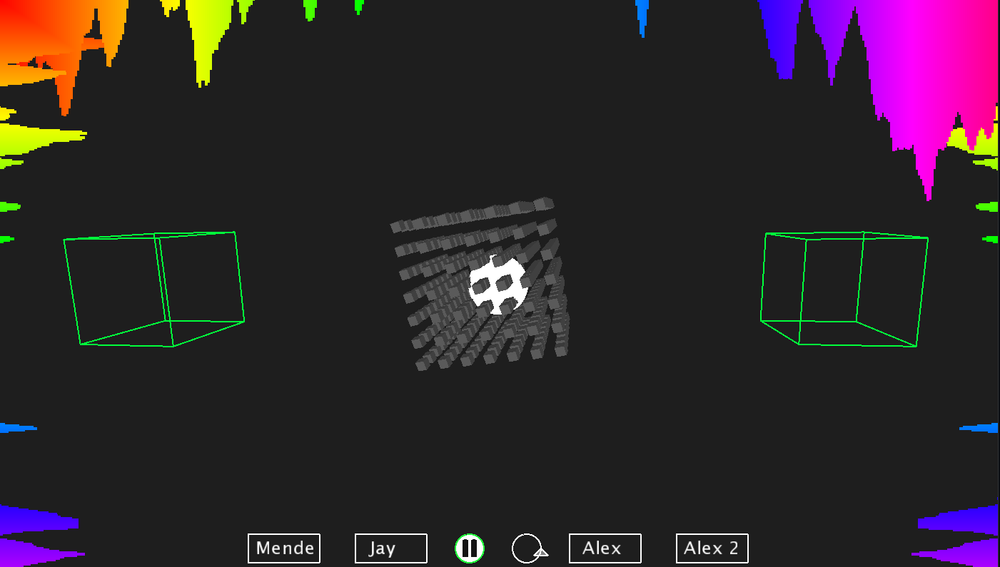

# Music Visualiser Project

Name: Alexander Dergach, Jaycel Estrellado, Mendbayar Bat-Orshikh

Student Number: C20401562, C20372876, C20458384

# Description of the assignment
Welcome to our Music Visualizer Project. This assignment will consist of 5 distinct visual effects. An interactive menu will be displayed and as the user, you are able to switch through different renders using button clicks.

### First Visual

The first Visual is comprised of 3 components, center, side and top/bottom. 
In the center there is two distorted semi circles, made of thin lines each respective line being sound responsive with both size and colour, they are separated giving room for a row of ellipses in the middle, which are also synchronizing with the music. From the very center steams a flower pattern made of dots along with a beam of colour going off to the corner of the screen, the flower petal design vibrating as the music plays intensifies with the amplitude, the lazer beam also being sound responsive and only visible when the actual song is playing.
At the sides you will find two identically placed illustrations, made of ellipses with no fill creating a scribble effect and the width and height of the ellipses changing with the song. 
Random generated lines are placed at the top and bottom of the screen and it is also synchronizing with the music- adding a more visualizing effect to the program.
Adding this randomly generated beams, creates a more chaotic approach to the visual contrasting with the other effects.


### Second Visual

A



### Third Visual

A


### Fourth Visual

A


### Fifth Visual

A

# Instructions

### Starting Visuals

- First you clone this repository
- Open it in an IDE, press *F5* to run the visual
- Opening the Main Menu

### Main Menu

- You may select a render and press on the middle play button to play that persons render
- Menu will collapse into a lower menu, you are able to *loop*, *pause/play*, or *change* to another persons render


# How it works


# What I am most proud of in the assignment

# Markdown Tutorial

This is *emphasis*

This is a bulleted list

- Item
- Item

This is a numbered list

1. Item
1. Item

This is a [hyperlink](http://bryanduggan.org)

# Headings
## Headings
#### Headings
##### Headings

This is code:

```Java
public void render()
{
	ui.noFill();
	ui.stroke(255);
	ui.rect(x, y, width, height);
	ui.textAlign(PApplet.CENTER, PApplet.CENTER);
	ui.text(text, x + width * 0.5f, y + height * 0.5f);
}
```

So is this without specifying the language:

```
public void render()
{
	ui.noFill();
	ui.stroke(255);
	ui.rect(x, y, width, height);
	ui.textAlign(PApplet.CENTER, PApplet.CENTER);
	ui.text(text, x + width * 0.5f, y + height * 0.5f);
}
```

This is a youtube video:

[](https://www.youtube.com/watch?v=J2kHSSFA4NU)

This is a table:

| Heading 1 | Heading 2 |
|-----------|-----------|
|Some stuff | Some more stuff in this column |
|Some stuff | Some more stuff in this column |
|Some stuff | Some more stuff in this column |
|Some stuff | Some more stuff in this column |

